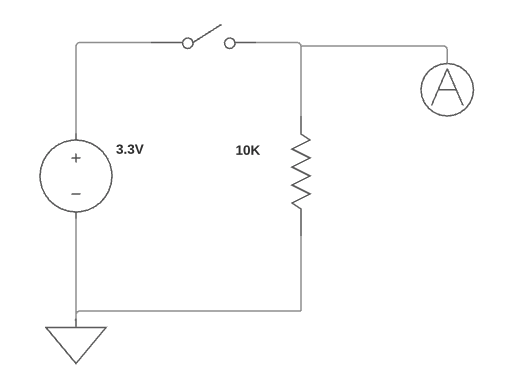
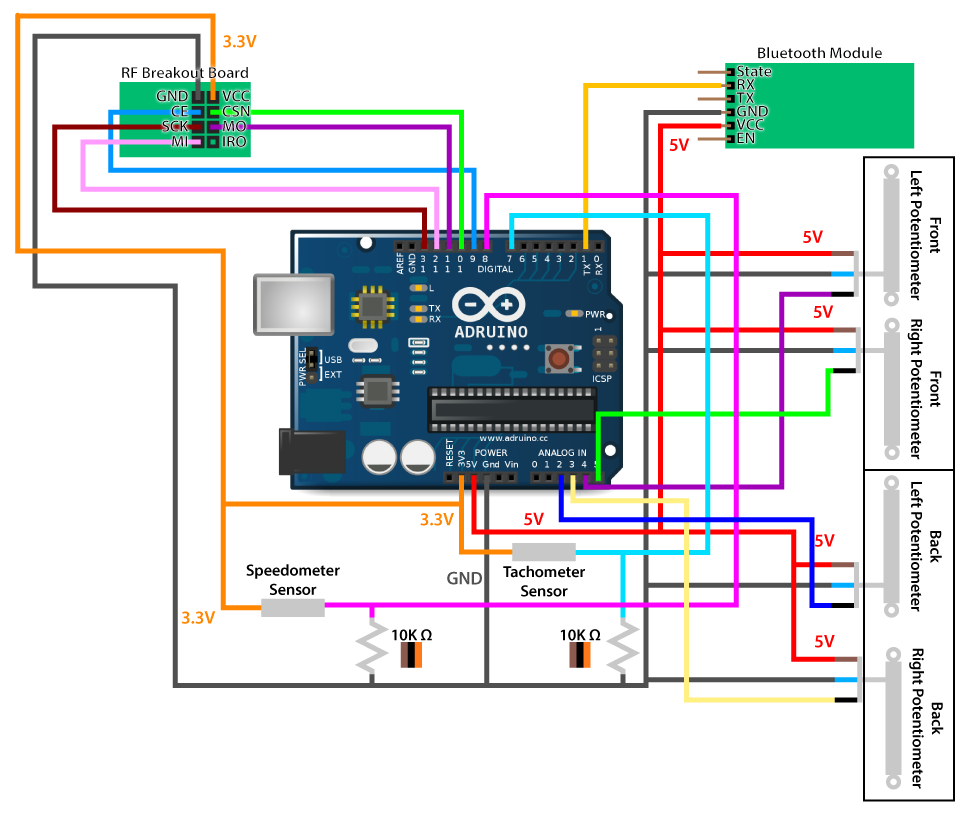

# Circuit

## Components

  * Arduino
  * Bluetooth module
  * RF transceiver
  * Linear potentiometer **x2**
  * Magnetic switch **x2**
    * 1 for the speedometer
    * 1 for the tachometer

## Connections

  * **Module**: Aruduino Pin

### Bluetooth Module

  * **VCC**: 5V
  * **GND**: GND
  * **RX**: TX
  
People on the internet note how the chip on the Bluetooth module isn't made to handle ``5 V``. However, the module that I've purchased **can** handle ``5 V`` and is labeled as being able to handle ``3.3 V - 6 V``. 

### RF Transceiver

  * **VCC**: 3.3V
  * **GND**: GND
  * **CE**: Pin 9
  * **CSN**: Pin 10
  * **SCK**: Pin 13
  * **MOSI**: Pin 11
  * **MISO**: Pin 12

### Magnetic Switches

Both the switches have the same circuit but the speedometer has a different input pin than the tachometer, obviously.

Both switches are connected to the Arduino's ``3.3 V`` output with a ``10K Ω`` pull-down resistor connected to GND on the arduino. The A circle connects to the Arduino's digital pins as explained below.

  * **Speedometer**: pin 8
  * **Tachometer**: pin 7

### Linear Potentiometer

There are 2 linear potentiometers, one for a right shock and one for a left. Both potentiometers ared wired as follows:

  * **Blue wire**: GND
  * **Brown wire**: 5V
  * **Shield wire**: not connected

Each one is connected differently as follows:

  * **Left black wire**: A4
  * **Right black wire**: A5

## Final circuit

## Circuit Assembled

