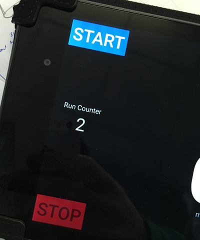

# How To Use the Instrumentation System

These instructions are as of April 16, 2018. This was made before the mounting was completed for the Android tablet and the Arduino.

## Arduino Setup

tl;dr

  1. Insert protoboards into Arduino, tape together.
  2. Insert Arduino into case.
  3. Tape battery to outside of case.

Make sure the protoboards are connected properly to the Arduino (they will only match up in the correct orientation) as shown in the photo below. Also apply a mediocre taping job (with electrical tape) to hold the protoboards on. Past tests deemed this necessary to prevent them from disconnected. Make the tape tight but not overwhelmingly so, the boards are relatively fragile. See the picture below:

Situate the Arduino in the case such that the molex connectors and the USB cable can exit the zipper all together in one spot. Make sure the bluetooth module is not extending outside the case. See the image below.

Zip both sides of the zipper to the protruding connectors tightly.

Tape the USB battery pack onto the outside of the case. Make sure the button, indicated with the green arrow in the image below, is not covered by the tape. Also make sure the charge indicator, indicated by the red arrow in the image below, is not covered as well.

Press the button to check the charge state on the battery. The bar indicated with the red arrow will light up blue to indicate charge. The Arduino does not use much battery power to operate, but just in case make sure the charge is at least half way full. To charge the battery pack, use a micro USB cable.

Plug the USB cable into the battery before use. Leave the USB cable unplugged when not in use.

## Mounting the Arduino

Currently no case is available for the Arduino, so we just use the case shown in the pictures above. To mount the case on the car, just use some zip ties to tie it inside the cockpit, next to the seat, or in the back above the engine somewhere.

## Connecting the Arduino

On the Arduino's molex connections are letters indicating which sensor they should be hooked up to. The sensor molex connectors are also labeled. For quick setup, merely connect the matching letter molex connectors together. Letter explanations are below:

| Letter | Sensor |
| --- | --- |
| S | Speedometer |
| T | Tachometer |
| FR | Front Right shock |
| FL | Front Left shock |
| ST | Speedometer Test sensor |

Sometimes the molex connectors are hard to plug into each other. To remedy this, first make sure the female pins, marked by the red arrow below, are sufficiently opened. Stick a small pin into them and work it around to widen the pin if necessary. Also, make sure the male pins, indicated with the green arrow below, are centered. If they're stuck off to the side, insert a small pin to the plastic and try to work the pins into the middle. Don't push down on the pins otherwise they may disconnect from the plastic.

Make sure the USB cord is plugged into the battery before driving the car, but don't leave it plugged in after driving.

## Using the Android App

### Bluetooth Connection

When turning on the Android app, notice the bluetooth icon in the bottom right of the app. If it is red, as shown below, then the Android has not been able to connect to the Arduino.

When the Android connects to the Arduino over bluetooth, the icon will turn blue, as shown below.

Note that sometimes when the app is first started up, the icon will stay red even afer the bluetooth has connected. To fix this, unplug the Arduino from its battery and then plug it back in.

### Saving Data Subsets

Subsets of data can be saved in what is called a *mini-run*. I personally start a new mini-run each time we switch out drivers when test driving. The current (if it's currently saving to a mini-run) or last run (if the saving has been stopped) is always indicated by the counter number as shown below. When **START** is highlighted, there is no mini-run being recorded and all data is being dumped to a singl file for the current date. To start a mini-run, press start. This will increment the run counter and the number of the current mini-run will be displayed in the run counter. Press **STOP** to stop. When a mini-run is being recorded, all data will continue to be dumped into the master data file for the current date.

### Retrieving Saved Data

To retrieve all the data from the Android app, plug the tablet into a computer and complete the following steps.

  1. Slide down from the top of the screen.
      * 
  2. Tap *USB for charging*.
      * 
  3. Select *File transfers*. This will allow the computer to read files on the device.
      * 
  4. On your computer, open the files.
      * On Windows, a window should open for transferring files.
      * On Mac, use Android official file transfer app: [Android File Transfer](https://www.android.com/filetransfer/)
      * For more help on transferring files, see [this Google support page](https://support.google.com/nexus/answer/2840804).
  5. Data is saved under ``Downloads/byu_baja`` followed by the current date, as shown below (on my Mac):
      * 