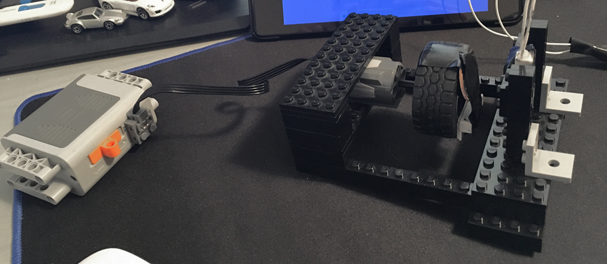
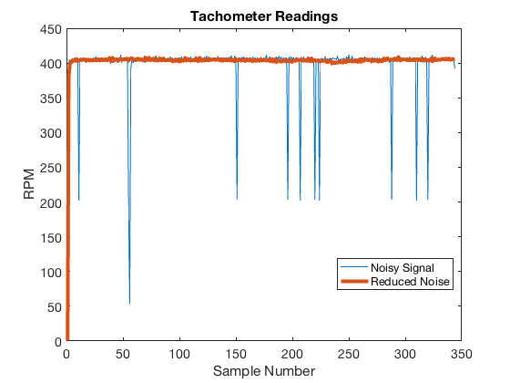

# Speedometer/Tachometer Documentation

The speedometer and tachometer use nearly the same circuit and code; thus they are grouped together.

## Models

### Circuit

A pull down resistor is required to pull the input pin to ground when the sensor is open in order to get a constant ``0``. Otherwise the pin will be floating and values become unpredicatable. A ``10 KΩ`` resistor was used along with the ``3.3 V`` pin to limit current to ``0.33 mA``. The ``5 V`` pin would also work fine (with a current of ``0.5 mA``.

### Sensor Noise

Initial prototypes revealed the need to debounce the speedometer. Initially I used a simple state machine (without any timers) to debounce the signal.

Even with this state machine, however, the magnet was being picked up twice per revolution. I suspect that has something to do with the fact that most analog signals are bouncy, but also note the magnetic pattern of the sensor's pick-up magnet as seen below.

This problem was fixed by simply dividing the output by two. To test this method, I built a simple LEGO contraption to measure RPMs as can seen below. More information on this is contained in the [tests](../tests/speedotachometer/) section.

As shown below, this setup ran at a constant 400 rpm. This data, however, was initially very noisy. Changes to the state machine were which seemingly fixed this.

However, with a test drive in the car, recorded data said otherwise. The speedometer was *very* noisy, as shown in the data below. See the [first driving test](../tests/driving_tests/2018-02-17_first_instrumentation_test/) section for more info.

### Debouncing

In light of the problems explained about, I decided to turn to an actual debounce timer. Calculations (contained within [the matlab file](debounce_timer.m)) produced the following plot of max and min measured speeds with a ``1 cm`` long magnet mounted on the rear axle with various debounce times. More info regarding this is in the [debounc documentation](debouncing.md)

