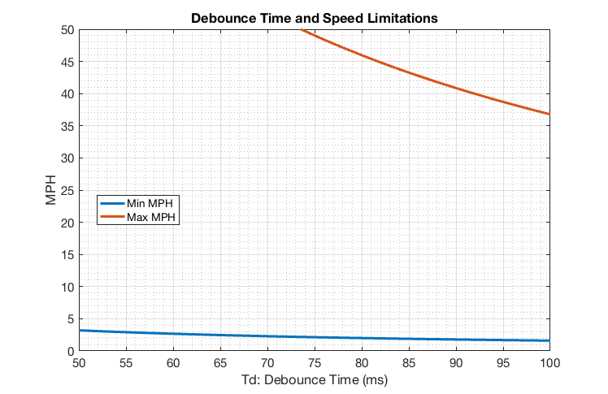

# Speedometer/Tachometer Documentation

The speedometer and tachometer use nearly the same circuit and code; thus they are grouped together.

## Circuit

A pull down resistor is required to pull the input pin to ground when the sensor is open in order to get a constant ``0``. Otherwise the pin will be floating and values become unpredicatable. A ``10 KΩ`` resistor was used along with the ``3.3 V`` pin to limit current to ``0.33 mA``. The ``5 V`` pin would also work fine (with a current of ``0.5 mA``).

## Prototypes, Tests, Models (Chronologically)
``
### Bicycle Wheel

With the circuit hooked up to the Arduino and connected over Bluetooth to the Android tablet, I installed the sensor on my roommate's bicycle wheel. Through this test I discovered that the magnet was being picked up twice per revolution. I suspect that has something to do with the fact that most analog signals are bouncy, but also note the magnetic pattern of the sensor's pick-up magnet as seen below.

This problem was fixed by simply dividing the output by two.

### 89 Car Output Shaft

The CVT wasn't installed on the 89 car for the time so installed the sensor directly on the engine output shaft. The full Arduino to Android connection was setup. We had some sotware troubles with the Android getting frozen (due to errors in the code for the app) but this prototype showed that the tachometer can adequately read the max speed of the engine with the tachometer, reading up to a little over ``3500 rpm``. (There is a question of why the engine didn't rev higher, it should max out at ``3800 rpm``.) See [this test's page](../tests/tachometer_output_shaft/) for more details.

### Lego Contraption

I built a simple LEGO contraption to measure the accuracy of the rpm readings. This contraption can be seen below. More information on this is contained in the [tests](../tests/lego_tachometer/) section.

As shown below, this setup ran at a constant 400 rpm. This data, however, was initially very noisy. Changes to the state machine were made which seemingly fixed this.

### 89 Car Dyno Test

We ran the 89 Baja car on the dyno and hooked up the tachometer and speedometer. The tachometer seemed to work just fine. Again, there were software issues and the engine maxxed out at ``3200 rpm`` which again is lower than expected.

However, the speedometer was very noisy, bouncing around like crazy. It essentially provided us no useful data.

See the [relevant test page](../tests/speedotachometer_car_dyno/) for more details.

### 89 Car First Drive

In this test the tachometer was not installed. However, this was the first test with the suspension sensors installed on the car. The suspension sensors worked just fine! This test also showed that all the software problems have been fixed and the data is properly being saved on the tablet. However, the speedometer was still very noisy, though it was better than the dyno test. The speedometer readings can be seen below.

See the [first driving test](../tests/driving_tests/2018-02-17_first_instrumentation_test/) section for more info.

### 27 Car First Drive

In this test, only the speedometer was hooked up without the magnet installed near the sensor. I was using this to test for sensor noise. Interestingly, the sensor read *absolutely nothing*, as shown below. This was good, but doesn't help us discover the source of our speedometer noise. For more details see the [test results](../tests/driving_tests/2018-03-30_no_magnet_test).

### Debouncing Model

In light of the problems experienced with speedometer accuracy, I decided to turn to an actual debounce timer. Calculations (contained within [the matlab file](debounce_timer.m)) produced the following plot of max and min measured speeds with a ``1 cm`` long magnet mounted on the rear axle with various debounce times. More info regarding this is in the [debounce documentation](debouncing.md). I have concerns about the small length of the magnet.

