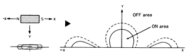
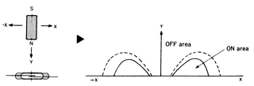
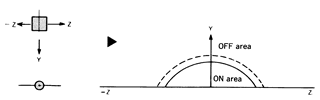
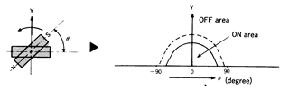

# Tachometer Documentation

## Materials

  * [Arduino](https://www.amazon.com/dp/B01EWOE0UU)
  * [Magnetic Switch](https://www.amazon.com/dp/B00LYCUSBY/)
  * 10K Resistor

## Circuit2

The resistor branch returning to ground is needed to *pull down* the sensor input, otherwise when the switch is open the reading on the sensor is unpredictable. This way, when the switch is open the sensor consistently reads a ``0``.

I used ``3.3V`` power simply to avoid damaging anything. The current through this should be ``0.33 mA`` this way... so low that none of these materials can possibly be damaged. Honestly, ``5V`` should also work just fine as well with this high of a resistor value but whatever.

## Arduino code

Using the **AnalogInOutserial** example. I removed the ``AnalogWrite`` parts of the code because I just want to print the sensor values on the **Serial Monitor** of the Arduino IDE.

## Range test

With giant stack of magnets, was able to get range of around ``4.6cm``. With the stock magnet (contained in the magnetic switch product) the range is around ``2.3cm``.

**Upadate**: 
I've discovered that I've probably been testing the magnetic switch with it facing the wrong direction.

## Changing to digital

We don't need an analog input for the speedometer and tachometer, and I calcuated that if we mount the magnet on the primary CVT covering (as drivetrain subsystem team members suggested) then we'll get a rotational speed of ``21.05 mm/ms`` at ``6000 rpm`` (note that this is way overestimating, the engine is limited to 3800 rpm). with this mounting position, we'll get ``~2.85 ms/magnet`` but because the magnets are straight and the circular motion is not, I expect this to be lower, perhaps even down to ``1 ms/magnet``. This time is too small for the Arduino's analog read speed of 2 ms.

Switching to Digital inputs! The digital read apparently only takes 5 μs. However, in my testing I got the loop to run about every ``1.36 ms``. This may still be fast enough to properly read the magnet. If not, we can simply mount more magnets.

Note magnet dimensions are ``60x10x3 mm``.

I can't tell if I need to debounce this or not... when I continuously print the output I see no bounce. However, when I only print the output when there's a change, then I see bounce.

## Tachometer test 1: bicycle wheel speed

I hooked up the tachometer to my roommate's bicycle and connected my Nexus 7 to the Arduino over Bluetooth. It was able to read the wheel speed just fine! I discovered that the sensor apparently picks up the magnet 2x per revolution. See the following manget pattern section for possible reasons for this. My solution was to simply divide everything by 2. [See the video for this test on youtube here](https://youtu.be/aEKP_hmpXtI). Now that it works, I need to make sure the switch and the Arduino can actually read a shaft rpm of up to 3800 rpm, the max rpm of the engine.

## Magnet Pattern

I found [this page on the Aleph website](http://www.aleph-usa.com/components/reed-switches/) (the supplier of the magnetic switches I'm using) which shows "magnet actuation patterns" which might be teh cause of the double trigger I was getting in the bicycle test. See the following images.

**Horizontal**

**Transverse**

**Perpendicular**

**Rotational**

## Tachometer test 2: On the 89 car engine

We hooked up the tachometer to the atual outputshaft of the engine on the 89 car. Luckily this coincided with the CVT and gearbox being worked on and not on the car, thus we had full open access to the outputshaft and it had nothing on it.

We simply taped the magnet to the outputshaft (with electrical tape) and the hookup switch to the engine block, close enough to read the magnet.

The first time we got it reading it went up to 5600 rpm. After it reached this value it got stuck on it. I'm not sure exactly what went wrong because all I needed to do was quit the app (fully quitting it from the Android *recents* menu). After doing this, the values weren't stuck and started making sense. After this, the engine maxed out at a little over 3500 rpm. **(Why isn't it 3800 rpm?)**

Regardless, this shows that the magnetic switch can read fast enough to get a relatively accurate reading.

## Tachometer test 3: slowmo lego contraption

Testing tachometer accuracy and noise by taking slow motion videos of a lego wheel spinning and comparing it to what the Arduino is reading. See videos in ``testing/speedoAccuracy``.

### Lego Setup

### Noise Reduction

During this test, I changed the Arduino code to reduce noise. See the plot below. Blue = original noisy readings, Red = noise reduced readings.

I believe the readings were sometimes glitching out (as you can see above) because the state machine was changing states too quickly thus giving incorrect readings. I also changed the rpm output from a moore output to a mealy output.

### Verified Accuracy

By watching the slowmo videos and counting how many times the small lego wheel spun per second, I verified that the sensor is reading quite accurately. With my imprecise counting, I counted ``408 rpm`` in one video and the sensor read around ``405-411 rpm``. That's very good! See the following video I used for this comparison.

<video style="height: 800px; width: auto; max-width: 500px; display: block; margin: 0 auto;" id="viewingRpm" preload controls>
  <source src="test3Lego/viewingRpm.m4v" />
</video>

### Using Tachometer for Fuel Consumption

Due to SAE Baja restrictions, we're considering using the rpm measurements to figure out how much fuel the car is burning over time, rather than integrating some kind of direct fuel measurement.

### Speedometer + Tachometer Dyno Test

This is the first time we've tested the sensors on the dyno! We hooked up both the tachometer and the speedometer sensors. The speedometer did NOT work. For example, at one point the dyno said the car was going 2 mph but the arduino output said 2 then 15 then 17 then 0 then 2, etc. Need to investigate this further.

Things we learned:
  * Need more permenant magnet mount to the clutch. It kept falling off.
  * Speedometer is not working properly.
    * Most likely a code issue as rearranging the sensor + magnet didn't seem to help.
  * Android app is crashing on the part that splits up the incoming text by spaces/colons. Not sure why this is happening but it's easy to fix.
  * Engine is maxing out at around 3200 rpm. At least, according to our tachometer.
  * Tachometer appears to be working **just fine**. We just need to mount the sensor and magnet better.
