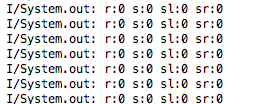
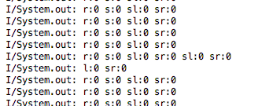

# Bluetooth Transmission Speed Test

## UPDATE

This test result is pretty much useless in practice as every little change affects it dramatically. However, I still a utilize similar testing procedures to tweak my transmission rates after each change.

I've discovered that if I only send data in big chunks that the data sampling speed can then be increased. At the moment of writing this, for example, data is saved into a long string about every ``5 ms`` and then at about every ``25 ms`` the data is transmitted.

## Materials

  * Arduino with bluetooth module
  * Android

## Setup and Procedure

  1. In the Arduino code ``sensorReading``, uncomment out the the line ``printValues();`` at the end of the `void loop()`` function.
  2. Program the Arduino with the ``sensorReading`` code.
  3. Make sure the bluetooth module is connected to the Arduino.
  4. Before programming the Android, make sure that in the file ``MainActivity.java`` the function ``handleBluetoothInput`` has the variable ``testing`` set to true.
  5. Program the Android with the BYUBaja app.
  6. Open the ``Run`` window so you can see the Android system out.
  7. Watch the output in the run window. It should look pretty much the same on every line.
  8. If you see the printing lines skip all over the place, the frequency must be decreased.
  9. Update ``#define MIN_PRINT_DELAY`` with a number in the Arduino code to test different values.

### Good Output

Note that more data may be added later such that each long has more information.

### Bad Output

## Results

I discovered that a period of ``12 ms`` resulted in a output that is very stable output with only 20 errors within 6457 prints. This means it is perfectly stable for ``99.69%`` of the time, which is very acceptable. Changing the period to ``11 ms`` reduced stability so far that I didn't even bother measuring it. A quick eye-ball calculation gave 4 errors in 15 prints or ``73%`` stability. This means that despite the frequency increasing from ``83.33 Hz`` (``12 ms`` period) to ``90.91 Hz`` (``11 ms`` period), at ``11 ms`` useful data is actually being received at ``66.67 Hz``.

There isn't really a target value for this frequency. I want it to be higher than ``60 Hz`` so that transitions will look smooth on the HUD, but it doesn't matter that much. Honestly, as long as the frequency is higher than ``10 Hz`` it'll be fine. Therefore, there's no point in pushing the frequency so far that the data starts getting garbled.

**Increasing the amount of data being sent from the Arduino in each line may alter these results.**