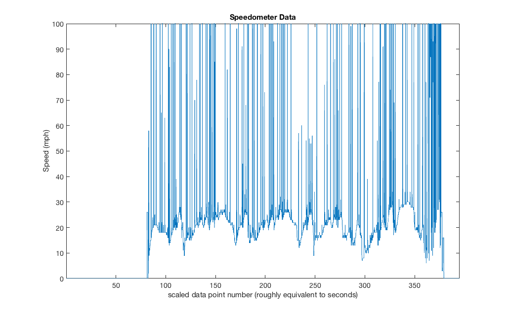

# Driving Test

## Feb 17, 2018

### First Driving Test With Instrumentation

#### Details

  * **Drivers**: Dallin Colgrove, Sage Stubbs
  * **Equipment**: me
  * **Faculty**: Dr. Hovanski
  * **Vehicle No.**: 89
  * Arduino inside of my Intel case, mounted next to the fuel tank with zip-ties.
  * Speedometer mounted with tape. 
  * Shock potentiometers mounted with brackets on the inside of the front shocks.
    * No shock sensors on the rear wheels. 
  * RF Antenna mounted but not in use. 
  * Tablet mount not created so the tablet was held inside a bag in between the driver's legs.
  * Tablet not using cell data, only bluetooth.
  * Problem with shock position values coupling together still unsolved.

#### Results

  * The speedometer sensor and magnet remained firmly attached.
  * All wiring undamaged.
  * Everything remained connected for Dallin's driving.
  * Sage drove more aggressively and the tablet lost its bluetooth connection with the Arduino at some point.
    * **Cause**: one of the protoboards slipped out of the Arduino header.
  * Speedometer sensor is working, but is quite noisy (spikes up to 60+ mph at times).
    * **Cause**: *unknown*
  * It's difficult to tell when the tablet has an established bluetooth connection with the Arduino.
    * Currently this is only done by looking at the tablet and jumping on the front of the car to see if the shock readings change.
  * Hard to tell if shocks are still coupling because their values are usually similar.

#### Data Analysis

##### Raw Data

The speedometer is **extremely** noisy. Notice however that there is a nice and consistent reading visible that seems quite accurate.

Note that the shocks stay within a range of ``40-98%`` travel. This is likely due to their mounting position. They supposedly have more travel than the actual shocks so this should be fine. However, what's concerning is that they appear to reach, or get **very** close to, max travel (``100%``) which means the potentiometers may become damanged if that max travel is exceeded. Obviously the min travel on the potentiometers is not a concern.

The x-axis is not exactly equivalent to time in seconds because some of the data points were garbled and thus I removed them from the set. By the end of it the time is 20s off, but it's not all that important. This can be fixed by timestamping the data points.

##### Smoothed

Steps can be taken to smooth out the noise. See here a perfectly reasonable speed progression for the car. Note the end of the data suddenly became *so noisy*, more so than the rest of the time, that the data had to be cut into two pieces with the latter part smoothed more aggressively.

It should be possible for the Android to filter the incoming speedometer data, but it would be better if we simply fixed the noise in the first place.

#### Next Steps

  * Make attachment of protoboards to the arduino more solid.
  * Make use of RF antenna.
  * Reduce speedometer noise.
  * Make more useful HUD on tablet.
  * Test shocks on car to see if their true range is within the gathered data.
  * Timestamp logged data.