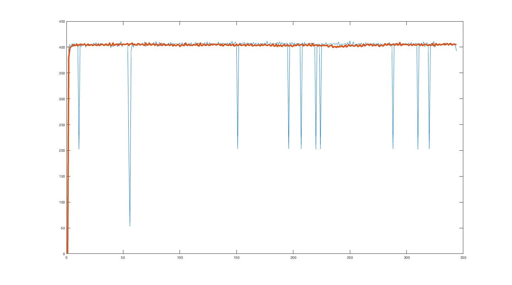

# Speedometer Accuracy

## Materials

  * Arduino with bluetooth module
  * Tablet
  * Reed switch

## Situation

The speedometer is consistently noisy. I encountered this on my initial design on a dyno run but was able to reduce the noise, as seen below:

However, once we completed our [first driving test](../driving_tests/2018-02-17_first_instrumentation_test/) it was apparent that the speedometer is still extremeley noisy, as seen below (taken from the driving test results):

Currently the state machine detecting reed switch triggers is simply run in the Arduino's ``loop()`` function. Perhaps moving this into an interrupt will improve the sensor's performance.

## Setup and Process

This test will compare the two methods (``loop()`` vs interrupt) on a bicycle since that is much easier to manage and we currently don't have an assembled Baja car :laughing:. I suspect the interrupt method will be much more accurate (it's the proper way to do it after all).

  1. 